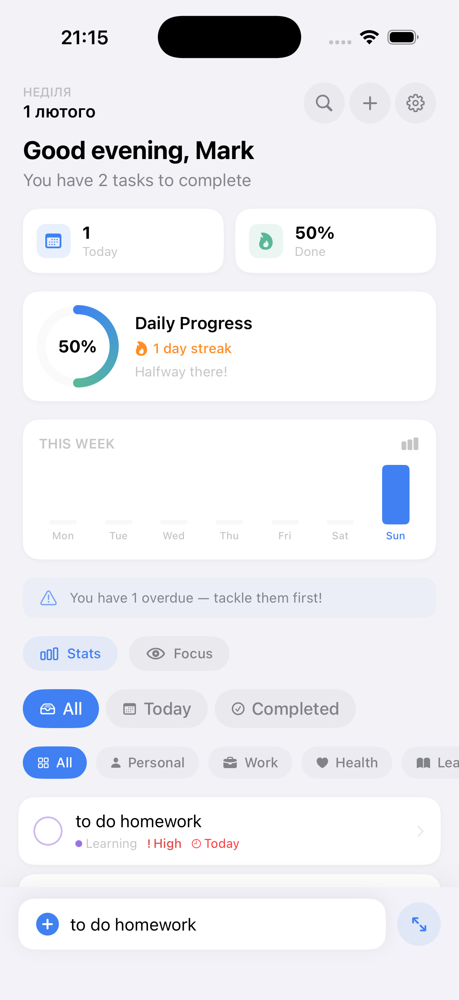
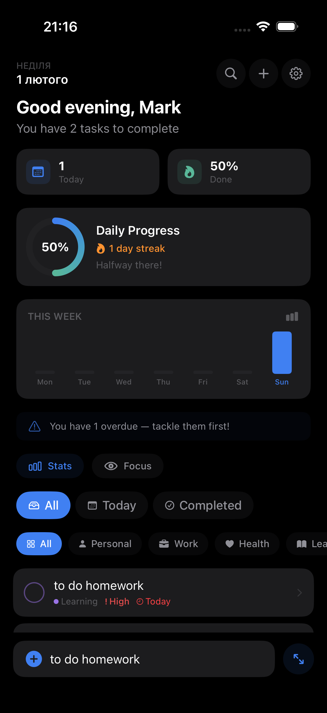
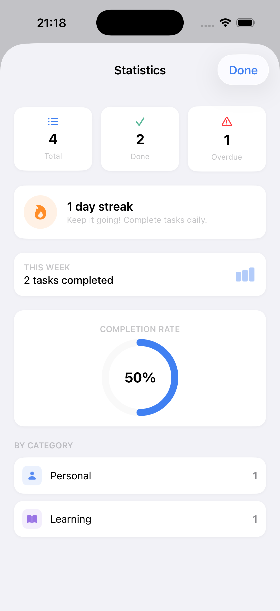

<div align="center">

# ✅ GlassTodo

**A production-grade iOS task manager built with SwiftUI & MVVM**


<br>

*Clean design. Subtle animations. Real features.*

<br>

<!-- Add your screenshots here -->
<!-- 




-->

</div>

---

## Features

### Core

- **Task management** — Create, edit, complete, and delete tasks with full CRUD support
- **Categories** — Personal, Work, Health, Learning, Errands — each with its own color and icon
- **Priority levels** — Low, Medium, High with visual indicators
- **Due dates** — Calendar picker with overdue detection and "Today" / "Tomorrow" labels
- **Subtasks** — Break tasks into steps with inline progress tracking
- **Notes** — Add context to any task with a full text editor
- **Search** — Instant filtering across all tasks

### Smart Features

- **Smart Lists** — Toggle between All, Today, and Completed views
- **Category filtering** — Horizontal chip bar to filter by category
- **Focus Mode** — One tap to hide completed tasks and concentrate on what's left
- **Quick Add** — Persistent bottom bar for rapid task entry without opening a sheet

### Visual & Interaction

- **Animated Progress Ring** — Gradient ring with spring animation showing daily completion rate
- **Weekly Heatmap** — 7-day activity bar chart on the home screen
- **Streak tracking** — Consecutive days with completed tasks, displayed in ring and stats
- **Confetti celebration** — Particle burst when the last active task is completed
- **Staggered row animations** — Tasks fade and slide in with micro-delays
- **Checkbox bounce** — Spring-scale animation on toggle
- **Swipe to delete** — Custom drag gesture with revealed delete button
- **Context menus** — Long-press any task for category, priority, toggle, and delete actions
- **Haptic feedback** — Tactile response on every meaningful interaction
- **Motivational messages** — Context-aware banners (overdue warnings, streak celebrations, quotes)

### Themes

| Theme | Description |
|-------|-------------|
| **System** | Follows device light/dark setting |
| **Light** | Clean and minimal |
| **Dark** | Easy on the eyes |
| **Soft Glass** | Subtle `.ultraThinMaterial` blur on cards only |
| **High Contrast** | Black background, yellow accent, maximum readability |

All themes use `UIColor` system tokens — they automatically respect Dynamic Type, accessibility settings, and reduce transparency.

### Screens

- **Home** — Header, greeting, progress ring, heatmap, motivational banner, filters, task list, quick add bar
- **Add Task** — Title, category picker, priority, date picker, subtasks, notes
- **Task Detail** — Full metadata, subtask management with progress bar, notes editor
- **Statistics** — Total/Done/Overdue cards, streak, weekly completions, progress ring, category breakdown
- **Settings** — Profile editing, theme picker with preview swatches, reset
- **Onboarding** — 3-page flow (Welcome → Name → Theme selection)

---

## Architecture

```
GlassTodo/                          29 files · ~2800 lines
│
├── GlassTodoApp.swift              App entry point
│
├── Models/
│   ├── Todo.swift                  Todo + Subtask + Category + Priority
│   ├── AppTheme.swift              5 theme types with resolved color tokens
│   ├── SmartList.swift             All / Today / Completed filter logic
│   └── UserProfile.swift           Display name + theme preference
│
├── ViewModels/
│   ├── TodoViewModel.swift         CRUD, search, filtering, stats, streak, heatmap, quotes
│   ├── OnboardingViewModel.swift   Page navigation + completion
│   └── SettingsViewModel.swift     Profile editing + reset
│
├── Views/
│   ├── ContentView.swift           Root router (Onboarding ↔ Home)
│   │
│   ├── Components/
│   │   ├── AnimatedProgressRing    Gradient ring + streak display
│   │   ├── CardView               Themed card (glass or solid)
│   │   ├── CategoryFilter          Horizontal category chips
│   │   ├── ConfettiView            50-particle celebration burst
│   │   ├── EmptyStateView          Contextual empty states per list type
│   │   ├── GreetingSection         Time-based greeting + summary pills
│   │   ├── HeaderView              Minimal sticky header with date + actions
│   │   ├── QuickAddBar             Persistent bottom input bar
│   │   ├── SmartListPicker         All / Today / Completed tabs
│   │   ├── TodoRow                 Rich row — checkbox, meta, subtask bar, swipe, context menu
│   │   └── WeeklyHeatmap           7-day activity bar chart
│   │
│   └── Screens/
│       ├── AddTodoSheet            Full task creation with subtasks + notes
│       ├── HomeView                Main screen — assembles all components
│       ├── OnboardingView          3-page welcome flow
│       ├── SettingsView            Theme picker + profile + reset
│       ├── StatsSheet              Statistics dashboard
│       └── TodoDetailSheet         Task detail — subtasks, notes, metadata
│
└── Services/
    ├── HapticService.swift         UIFeedbackGenerator wrappers
    ├── StorageService.swift        FileManager (todos) + UserDefaults (settings)
    └── ThemeManager.swift          ObservableObject theme state
```

### Design Decisions

| Decision | Rationale |
|----------|-----------|
| **MVVM without Combine pipelines** | ViewModels use `@Published` directly — simple, debuggable, zero overhead for this scale |
| **FileManager for todos** | JSON file scales better than UserDefaults for growing arrays; atomic writes prevent corruption |
| **UserDefaults for settings** | Small, rarely-changing data — the right tool for the job |
| **System color tokens** | `UIColor.label`, `.systemGroupedBackground` etc. — future-proof, accessibility-ready |
| **Glass only on cards** | Background stays neutral; blur applied only to `CardView` in Soft Glass theme |
| **Custom swipe gesture** | `.swipeActions` requires `List`; custom `DragGesture` works with `ScrollView` + themed cards |
| **SF Symbols only** | 6000+ built-in icons — zero reason for third-party icon libraries |
| **No external dependencies** | Pure SwiftUI + Foundation + UIKit (haptics). Nothing to update, nothing to break |

---

## Getting Started

### Requirements

- **Xcode 16+**
- **iOS 18.0+**
- macOS Sonoma or later

### Setup

```bash
git clone https://github.com/kozhydlo/GlassTodo.git
cd GlassTodo
open GlassTodo.xcodeproj
```

Or create a new project manually:

1. Xcode → File → New → Project → iOS App → SwiftUI → Swift
2. Product Name: **GlassTodo**
3. Delete the auto-generated `ContentView.swift` and app file
4. Drag all files from this repo into the project, preserving the folder structure
5. `⇧⌘K` (Clean) → `⌘B` (Build) → `⌘R` (Run)

### Folder Structure in Xcode

Make sure your Xcode navigator matches the folder structure above. All groups should be **real folders** (yellow icons), not virtual groups (blue icons). When adding files, select "Create groups" in the import dialog.

---

## Persistence

| Data | Storage | Location |
|------|---------|----------|
| Todos + Subtasks + Notes | JSON file via `FileManager` | `Documents/todos_v2.json` |
| User profile | `UserDefaults` | `gt_user_profile` |
| Theme preference | `UserDefaults` | `gt_theme` |
| Onboarding flag | `UserDefaults` | `gt_onboarding_done` |

All mutations auto-save immediately. No manual save action needed.

---

## Screenshots

| Screenshot | Description |
|------------|-------------|
| `home-light.png` | Home screen, light theme, with tasks |
| `home-dark.png` | Home screen, dark theme |
| `detail.png` | Task detail with subtasks |
| `stats.png` | Statistics screen |
| `add-task.png` | Add task sheet |
| `onboarding.png` | Onboarding flow |
| `confetti.png` | Confetti celebration moment |

---

## Roadmap

- [ ] Widgets (iOS WidgetKit)
- [ ] iCloud sync
- [ ] Recurring tasks
- [ ] Drag-to-reorder
- [ ] Custom categories
- [ ] Siri Shortcuts integration
- [ ] Apple Watch companion app
- [ ] Localization (UA, EN, DE, FR)

---

## Tech Stack

| Component | Technology |
|-----------|------------|
| UI Framework | SwiftUI 5 |
| Architecture | MVVM |
| State Management | `@Published` + `@StateObject` + `@EnvironmentObject` |
| Persistence | `FileManager` + `UserDefaults` |
| Animations | Spring physics, `withAnimation`, `AngularGradient` |
| Haptics | `UIImpactFeedbackGenerator`, `UINotificationFeedbackGenerator` |
| Icons | SF Symbols (system) |
| Min Deployment | iOS 18.0 |
| Dependencies | **None** |

---

## Contributing

1. Fork the repo
2. Create your feature branch (`git checkout -b feature/amazing-feature`)
3. Commit your changes (`git commit -m 'Add amazing feature'`)
4. Push to the branch (`git push origin feature/amazing-feature`)
5. Open a Pull Request

---

## License

This project is available under the [MIT License](LICENSE).

---

<div align="center">

Built with SwiftUI · Zero dependencies · Made for iOS 18+

</div>
